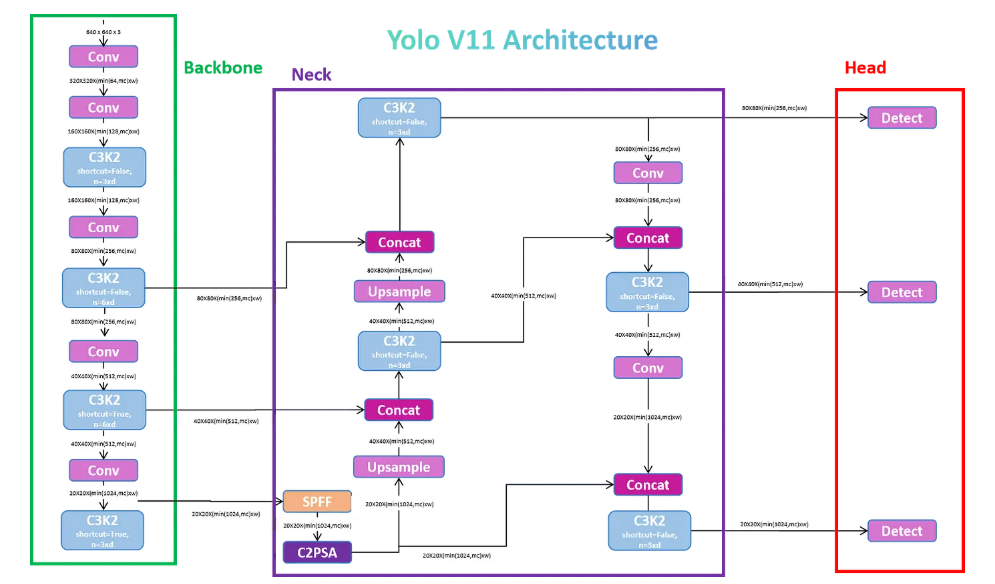
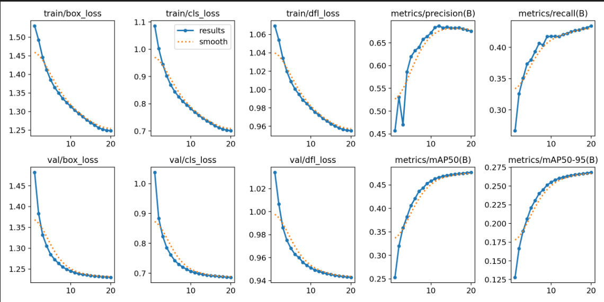

## Model Selection and Training

Overall two models were considered for the project.
1. YOLO11 from Ultralytics : for full training and evaluation
2. FasterRCNN from PyTorch : for building a custom training pipeline

### For full training and evaluation: YOLO11 from Ultralytics

- YOLO is fast, accurate, efficient and SOTA for object detection.
- All essential qualities for real-time autonomous driving. 
- Unlike many other detectors, YOLO is a single stage detector - localize and classify in one pass. 
- YOLO handles objects of different sizes well, from large buses to tiny traffic lights. 
- It also works well with standard evaluation metrics like mAP@0.5, mAP@[.5:.95], precision and recall
- Compared to YOLOv8, YOLO11 achieves higher mAP scores on benchmarks like COCO
- Great fit for quickly building the detection system.

Compared to other Ultralytics models, YOLO11 introduces new building blocks like C3k2 and C2PSA, which improve feature extraction and spatial attention. This helps in more accurate object detection with fewer parameters and FLOPs.

#### YOLO11 Architecture

Can be divided into three parts:

- **Backbone (Feature Extractor)**: Starts with simple convolution blocks, then uses the new C3K2 to pull better features with less work.
- **Neck (Feature Combiner)**: Uses SPFF to mix features from different scales.
- **Head (Detection Part)**: Uses C2PSA attention to focus on important areas before predicting boxes and classes.

YOLOv11's architecture builds upon prior YOLO versions (v8–v10) with three improvements:

1. **C3K2 blocks** – efficient backbone feature extraction using smaller kernels. 
2. **SPFF** – multi-scale pooling for better detection. 
3. **C2PSA blocks** – spatial attention modules for boosting accuracy.

#### Training Parameter Selection for this project

I ran multiple experiments with different parameters and models(YOLO11s, YOLO11m, YOLO11n) to find the best model. I got agreeable results with YOLO11s model.

1. The choice was due to GPU memory constraints and time taken for training.
2. I have used the following parameters for training:
    - **Batch Size**: -1 (auto batch selection considering the vRAM)
    - **Epochs**: 20
    - **Image Size**: 260
    - **Optimizer**: AdamW
    - **Initial Learning Rate**: 0.0025
    - **Final Learning Rate**: 0.01
    - **Cosine Learning Rate Scheduler**: True
    - **Label Smoothing**: 0.01
3. The total training time was 4.5 hours.

The training curve is given below:

### For custom training pipeline demonstration: FasterRCNN from PyTorch

- Faster R-CNN gives high accuracy with region-based detection
- ResNet-50 is a balanced backbone for speed vs performance
- Pretraining on ImageNet speeds up training and improves generalization
- Available in PyTorch model hub. 

