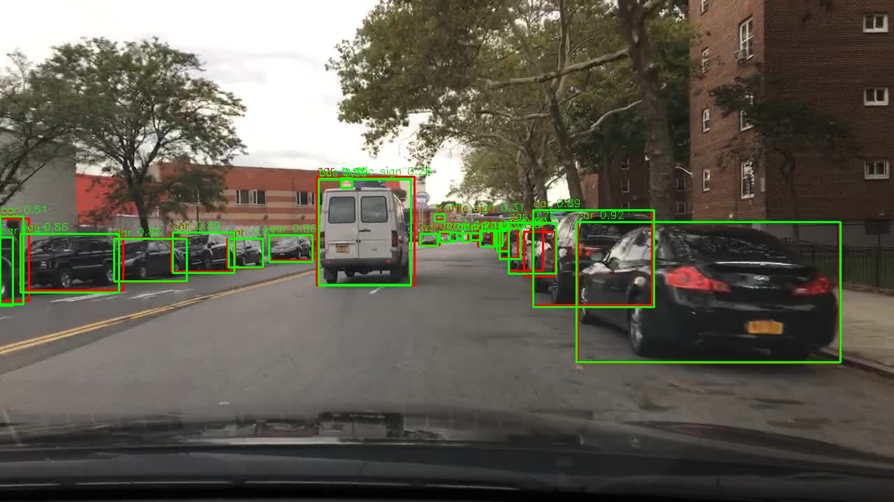
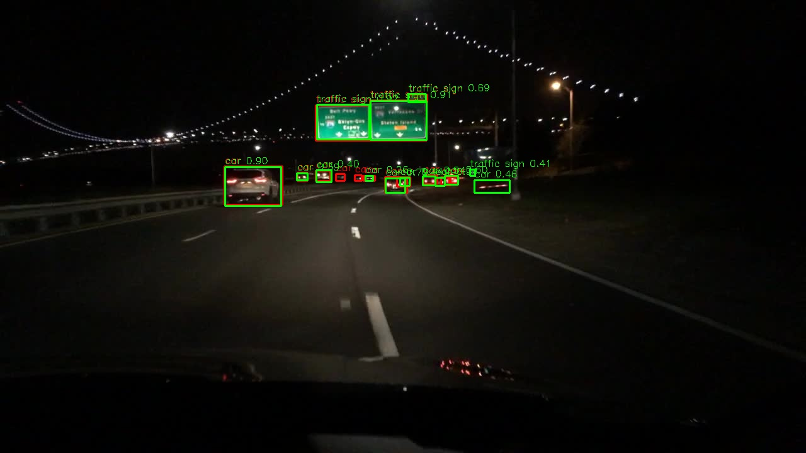
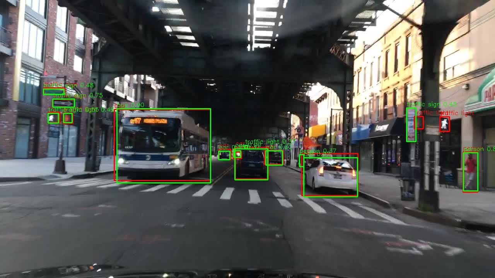
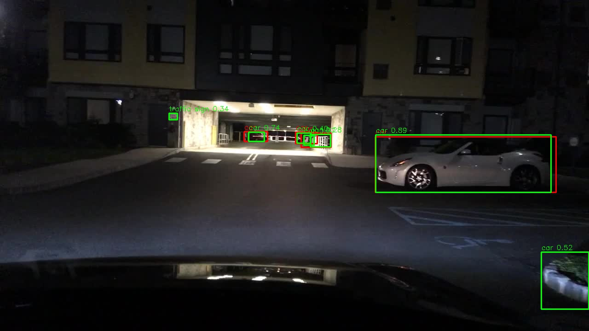
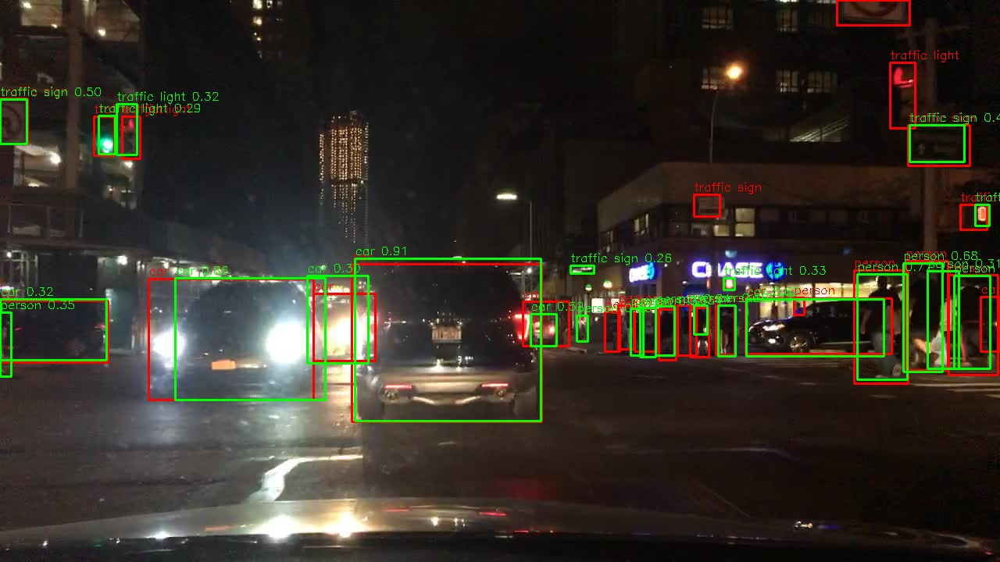

## Model Analysis - Mectric Selection, Quantitative, Qualitative Analysis and Improvement areas. 

### Metric Selection

- **mAP@0.5** – Measures detection accuracy when a predicted bounding box overlaps the ground truth by at least 50% IoU. Good for assessing class-level detection.
- **mAP@[.5:.95]** – Stricter IoU thresholds (0.5 to 0.95), tells how well the model localizes objects.
- Precision – Proportion of predictions that are correct (low false positives).
- Recall – Proportion of actual objects detected (low false negatives).
- IoU Distributions per Class – To assess localization quality beyond a single threshold.

### Quantitative Analysis

Available in `notebooks/02_YOLO_QuantitativeAnalysis.ipynb`

#### Overall Model Results

| Metric        | Value |
| ------------- | ----- |
| mAP\@0.5      | 0.478 |
| mAP@\[.5:.95] | 0.269 |
| Precision     | 0.674 |
| Recall        | 0.436 |

The model performs arguebaly well on high-frequency, large-sized classes like car, traffic sign, and traffic light, but struggles with low-frequency, small-sized classes like bike, rider, and motor. train detection fails entirely, consistent with its extremely low presence in the dataset. Model can successfully detect 43% of objects in the dataset.

#### Per-Class Performance Insights

- **Car** achieves the highest performance among all classes, with mAP@0.5 = 0.763 and mAP@[.5:.95] = 0.476, supported by high recall (0.710) and precision (0.752). This matches its dominance in the dataset (102,506 instances).

- **Traffic sign** also performs strongly, with mAP@0.5 = 0.606 and mAP@[.5:.95] = 0.319, precision (0.690) and recall (0.553), despite many being small objects. Tells that model can localize and detect small objects well. 

- **Traffic light** shows mAP@0.5 = 0.565 but drops to 0.212 for mAP@[.5:.95], so localization challenges for small, elevated objects, even though recall (0.512) remains average.

- **Person** detection yields mAP@0.5 = 0.574 and mAP@[.5:.95] = 0.281 with recall (0.513), mayb partial misses in crowded or occluded scenes.

- **Bus** (mAP@0.5 = 0.563, mAP@[.5:.95] = 0.432) and **Truck** (mAP@0.5 = 0.595, mAP@[.5:.95] = 0.427) perform consistently well given their medium/large sizes, but still trail cars due to fewer instances (1,597 buses, 4,245 trucks).

- **Rider**, **Bike**, and **Motor** suffer from both low recall (<0.37) and low mAP@[.5:.95] (<0.19), due to their lower frequency in the dataset (649 riders, 1,007 bikes, 452 motors) and smaller bounding box sizes.

- **Train** detection fails completely (mAP@0.5 = 0.000, Recall = 0.000) due to extreme class imbalance — only 15 instances in the validation set.

- This can be even seen in IoU distribution plot for each class. (see notebook)

From Data Analysis:
- Class imbalance - Explains strong car performance but weak detection for rare classes.
- Small object dominance in some classes - Explains poor IoU for traffic signs/lights.

### Qualitative Analysis

Available in `notebooks/03_YOLO_QualitativeAnalysis.ipynb`

1.  Analysis was performed even manually by overlaying the predicted bounding boxes on the images. (`src.autonomous_vision.object_detection.yolo_overlay`)
2. Analysis was also performed using `FiftyOne` app.

#### Observations (Results and from data analysis)

- Compliments the quantitative analysis.
- Total overlap was observed for high frequency classes and partial overlap for others. 

- Even in challenging lighting (like tunnel, rainy street), cars remain consistently detected.
- In several scenes, partially occluded cars (under bridges or behind other vehicles) are still correctly localized. 
- This confirms the EDA about cars. 

- In the nighttime image, smaller classes like traffic lights and bikes are frequently missed, despite being visible to the human eye.
- This matches the time-of-day data analysis, where dawn/dusk/night samples are limited, leading to weaker generalization.

- Small objects like traffic signs and traffic lights are sometimes detected but with bounding boxes that drift from the GT, reducing IoU scores to 0.5–0.7 
- This is consistent with the size distribution analysis, which showed these classes are disproportionately small.

- In the tunnel and rainy scenes, there are extra detections on background elements (poles).
- This aligns with the scene distribution analysis, which highlighted the scarcity of tunnels, parking lots, and adverse weather, causing poor generalization.

- Classes like train, bike, and rider are missing entirely from predictions in these examples 
- Consistent with both the per-class mAP table and dataset imbalance findings.

- Some examples are shown below.

### Improvement Areas

- Verify Ground Truth Annotations – Checking and correcting inaccurate bounding boxes, as label errors can directly lower IoU and mAP.

- Train Larger YOLO Model – Using larger variants (YOLO11m/l/) and extend training to 200–300 epochs for better convergence, especially for rare classes.

- Careful Hyperparameter Tuning – Optimizing learning rate, momentum, weight decay, and augmentation parameters for better balance between recall and precision.

- Increase Input Resolution – Training at higher resolutions (1280×1280) to improve IoU and mAP for small objects like traffic lights, traffic signs, and riders.

- Targeted Sampling / Oversampling – Oversampling rare classes (train, motor, bike, rider) during training to counter class imbalance.

- Synthetic Data Generation – Using synthetic scene compositing to increase rare class occurrences in varied environments.

- Augmentations – Applying nighttime simulation, rain/fog effects, and motion blur to improve generalization in underrepresented weather/time conditions.

### Inference Example

